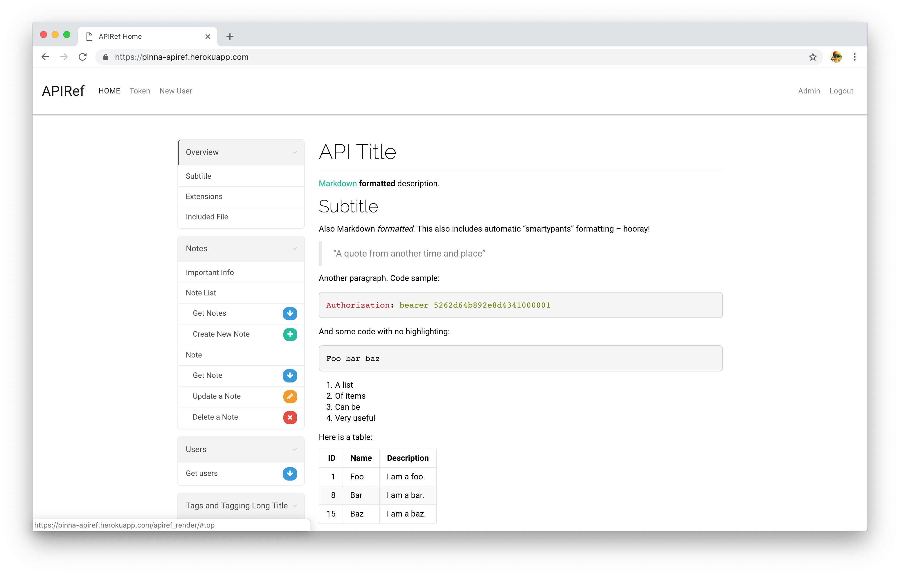

# apiref



API document server for team internal use.

# Submit compiled Blueprint

APIRef provides simple API to submit & update compiled API Blueprint. You can use another API doc instead of API Blueprint if it can compile as HTML.

You can post compiled API Blueprint using curl command. Thus, it is easy to post it on ci environment.

```
$ curl -d "<html><h1>Hello!</h1></html>" \
       -H "APIRef-Token: w1Wvmpins1k3jUYAC142Ne3QabjYCBcrGESB2jJ1kj4" \
       http://localhost:8000/submit_compiled_blueprint/ -X POST
```


# License

This software is freely distributed under the MIT, see LICENSE for detail.
